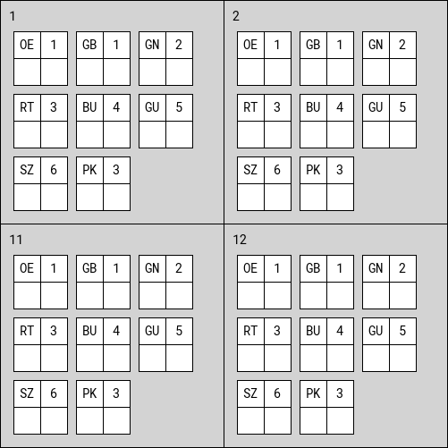

climbing-scorecard
===

A simple Python script, that will generate a climbing scorecard used for
Boulder sessions at [Bouldershabitat](http://www.bouldershabitat.de/) and
the [Bonner Boulderliga](http://bonnerboulderliga.de/) in Bonn, Germany.

Installation
---

Install the requirements:

	$ pip install -r requirements.txt

Usage
---

	Usage: scorecard.py [OPTIONS]

	Options:
	--start-number INTEGER  First route number
	--end-number INTEGER    last route number
	-o, --outfile TEXT      Name of the output file
	--help                  Show this message and exit.
